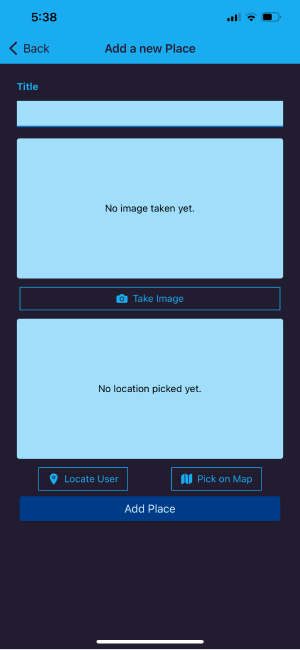
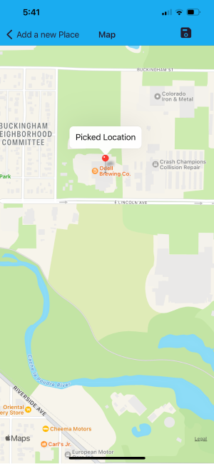
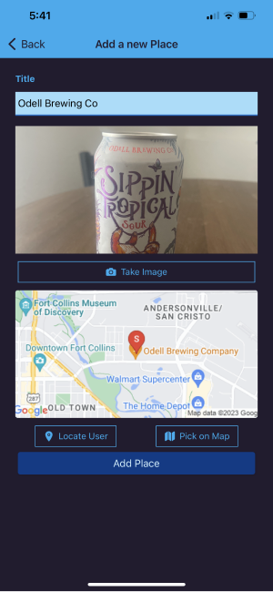
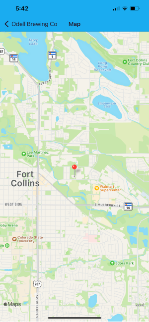

#PLVCE
---
The PLVCE mobile application is an app that utilized the device features such as Camera and Location to log the user's favorite place.

###Technologies
- React Native
- Expo
- SQLite

###Screenshots
Due to the fact that this app requires an actual device to unlock key features, I can only provide iPhone screenshots at this time.

